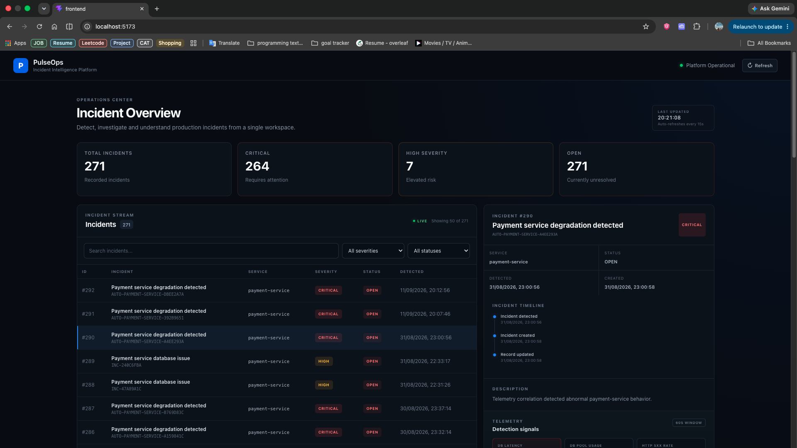
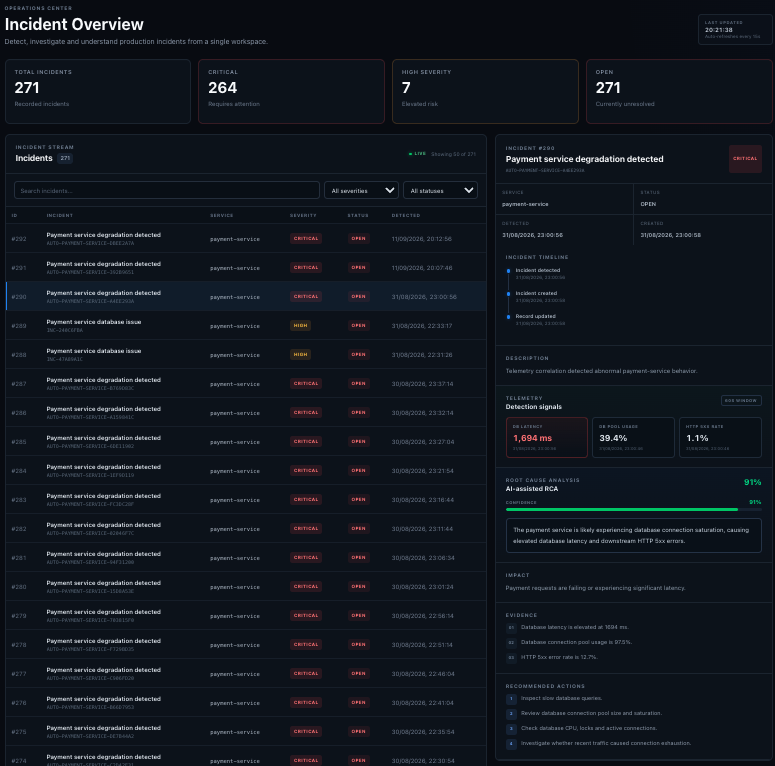

# PulseOps

### Distributed Incident Detection & Automated Root Cause Analysis

PulseOps is an event-driven incident detection and automated RCA platform designed to detect abnormal behavior across distributed services, correlate telemetry, create incidents, collect observability evidence, and generate evidence-backed root cause analysis.

It combines rule-based detection, anomaly scoring, distributed event processing, observability data, and LLM-assisted RCA into a single workflow.

The project also includes a lightweight React dashboard for investigating incidents, viewing telemetry, and reviewing RCA results.

---

## Dashboard

PulseOps includes a lightweight React dashboard for incident investigation.

### Incident Overview



### Incident Investigation



## Overview

In a distributed system, failures often appear first as a combination of symptoms rather than a single obvious error:

- increasing database latency
- connection-pool saturation
- elevated HTTP 5xx errors
- abnormal service telemetry
- degraded request performance

Looking at one signal in isolation can create false positives.

PulseOps therefore correlates related telemetry from the same service within a short time window and turns low-level signals into a higher-level incident.

The overall workflow is:

```text
Telemetry
    ↓
Correlation
    ↓
Detection
    ↓
Incident
    ↓
Evidence Collection
    ↓
RCA
    ↓
Dashboard
````

---

## Architecture

```text
                              ┌──────────────────────────┐
                              │      React Dashboard     │
                              │     Vite + TypeScript    │
                              │                          │
                              │ Incident Overview        │
                              │ Incident Investigation   │
                              │ Telemetry                │
                              │ RCA / Evidence           │
                              └────────────┬─────────────┘
                                           │
                                      REST API
                                           │
                                           ▼
                         ┌────────────────────────────────┐
                         │         PulseOps API           │
                         │          Spring Boot           │
                         │                                │
                         │ Telemetry Ingestion            │
                         │ Incident API                   │
                         │ Persistence                    │
                         │ Transactional Outbox           │
                         └───────────────┬────────────────┘
                                         │
                                  PostgreSQL
                                  + Outbox
                                         │
                                         ▼
                                   ┌───────────┐
                                   │   Kafka   │
                                   └─────┬─────┘
                                         │
                                         ▼
                         ┌────────────────────────────────┐
                         │       Event Processor          │
                         │          Spring Boot           │
                         │                                │
                         │ Correlation                    │
                         │ Detection                      │
                         │ Anomaly Analysis               │
                         │ Evidence Collection            │
                         │ RCA Orchestration              │
                         └───────┬───────────┬────────────┘
                                 │           │
                         ┌───────┘           └────────┐
                         ▼                            ▼
                    ┌─────────┐                 ┌─────────────┐
                    │  Redis  │                 │ Prometheus  │
                    └─────────┘                 └──────┬──────┘
                                                       │
                                                       ▼
                                                   ┌─────────┐
                                                   │  Tempo  │
                                                   └────┬────┘
                                                        │
                                                        ▼
                                           ┌────────────────────┐
                                           │     AI Service     │
                                           │     FastAPI         │
                                           │                    │
                                           │ Anomaly Analysis   │
                                           │ RCA Engine         │
                                           │ LLM + Fallback     │
                                           └─────────┬──────────┘
                                                     │
                                                RCA Event
                                                     │
                                                     ▼
                                           ┌────────────────────┐
                                           │    PulseOps API    │
                                           │                    │
                                           │ Persist Incident   │
                                           │ Persist RCA        │
                                           └────────────────────┘


Observability:

Applications → OpenTelemetry → OTel Collector → Tempo
Applications → Prometheus → Grafana
```

---

## Core Features

### Distributed telemetry ingestion

Services publish telemetry events containing:

* service name
* event type
* severity
* timestamp
* metric metadata
* trace/span identifiers when available

Telemetry is persisted through the PulseOps API before being published to Kafka.

---

### Event-driven processing

Kafka decouples telemetry ingestion from downstream processing.

The platform uses separate event flows for:

```text
telemetry.events
incidents.created
incidents.rca.requested
incidents.rca.completed
```

This allows telemetry processing, incident creation, and RCA generation to operate independently.

---

### Telemetry correlation

The Event Processor correlates related telemetry from the same service within a short detection window.

For the payment-service demonstration, correlated signals include:

```text
db_latency_ms
db_pool_usage
http_5xx_rate
```

The default demonstration correlation window is 60 seconds.

---

### Hybrid anomaly detection

PulseOps combines deterministic detection with anomaly analysis.

The payment-service detection pipeline considers conditions such as:

```text
db_latency_ms > 1000 ms
db_pool_usage > 90%
http_5xx_rate > 5%
```

The AI service can additionally perform anomaly scoring.

Rule-based detection remains available when the AI service is unavailable, preventing an AI failure from stopping incident detection.

---

### Automated RCA

After an incident is detected, the system collects evidence from:

* correlated telemetry
* Prometheus metrics
* Tempo traces

The RCA engine combines this evidence with AI-assisted reasoning to produce:

* root cause
* confidence score
* impact
* supporting evidence
* recommended actions

---

### Transactional Outbox

Telemetry and incident events use a transactional outbox pattern to prevent the database state and Kafka publication from becoming inconsistent.

The workflow is:

```text
Database Transaction
       │
       ├── Persist business/event data
       │
       └── Persist Outbox Event
                    │
                    ▼
              Outbox Publisher
                    │
                    ▼
                  Kafka
```

This ensures that the intent to publish an event is stored in the same database transaction as the associated application data.

---

### Redis-backed correlation

Redis is used for short-lived telemetry correlation and incident cooldown/idempotency behavior.

This helps prevent duplicate incidents when multiple related telemetry events arrive within the same detection window.

---

### Observability

PulseOps includes:

* Prometheus
* Grafana
* OpenTelemetry
* OpenTelemetry Collector
* Grafana Tempo
* OpenTelemetry Java Agent

This provides both metrics and distributed tracing for investigating incidents.

---

### Incident Investigation Dashboard

PulseOps includes a lightweight frontend built with React, Vite, and TypeScript.

The dashboard provides:

* incident overview
* incident count and severity statistics
* incident search and filtering
* incident list
* severity and status indicators
* incident detail view
* incident detection timeline
* telemetry metrics
* latest metric values
* RCA confidence
* root cause
* impact
* supporting evidence
* recommended actions
* automatic incident refresh

The frontend consumes the existing PulseOps REST API and does not introduce another backend service or database.

---

## Technology Stack

| Area                | Technology                            |
| ------------------- | ------------------------------------- |
| Backend             | Java 21, Spring Boot                  |
| Frontend            | React, Vite, TypeScript               |
| AI Service          | Python, FastAPI                       |
| Messaging           | Apache Kafka                          |
| Relational Database | PostgreSQL                            |
| Correlation / State | Redis                                 |
| Metrics             | Prometheus                            |
| Dashboards          | Grafana                               |
| Distributed Tracing | OpenTelemetry, Tempo                  |
| Telemetry Pipeline  | OpenTelemetry Collector               |
| RCA                 | Python + deterministic engine + LLM   |
| Containers          | Docker, Docker Compose                |
| Database Migrations | Flyway                                |
| Testing             | JUnit, Spring Boot Test, Python tests |
| Frontend Build      | Vite                                  |

---

## Service Structure

```text
pulseops/
│
├── frontend/
│   ├── src/
│   │   ├── components/
│   │   ├── types/
│   │   ├── App.tsx
│   │   └── App.css
│   ├── package.json
│   └── vite.config.ts
│
├── services/
│   ├── ai-service/
│   ├── event-processor/
│   ├── inventory-service/
│   ├── order-service/
│   ├── payment-service/
│   ├── pulseops-api/
│   └── pulseops-common/
│
└── infrastructure/
    └── docker/
        └── docker-compose.yml
```

---

## Service Responsibilities

### PulseOps API

Responsible for:

* telemetry ingestion
* incident creation
* incident listing
* incident retrieval
* incident persistence
* telemetry persistence
* RCA persistence
* Kafka publication
* transactional outbox processing
* consuming completed incident/RCA events

The API exposes both application-facing endpoints and the data consumed by the frontend dashboard.

---

### Event Processor

Responsible for:

* consuming telemetry
* correlation
* anomaly detection
* incident detection
* observability evidence collection
* RCA orchestration
* incident/RCA event publication

The Event Processor is a non-web Spring Boot application because its primary interface is Kafka rather than HTTP.

---

### AI Service

Provides:

* anomaly detection
* RCA engine
* LLM-assisted RCA generation
* deterministic fallback behavior

The AI service is isolated as a Python/FastAPI service so that Python, ML, and LLM dependencies remain separate from the Java services.

---

### Demo Services

The order, payment, and inventory services simulate distributed applications producing telemetry.

The payment service provides controllable failure modes for demonstrations:

```text
NORMAL
LATENCY
ERROR
```

`ERROR` mode returns HTTP 500 responses, providing a deterministic way to generate a payment-service degradation scenario.

---

### Frontend

The frontend is a small React dashboard designed for incident investigation.

It communicates with:

```text
React Dashboard
      │
      ▼
PulseOps REST API
      │
      ├── Incident List
      └── Incident Detail
```

The dashboard does not contain incident-detection logic. Detection and RCA remain backend responsibilities.

---

## Event Flow

### 1. Telemetry ingestion

```text
Demo Service
     │
     ▼
POST /api/v1/telemetry/events
     │
     ▼
PulseOps API
     │
     ├── PostgreSQL
     │
     └── Outbox
             │
             ▼
           Kafka
```

---

### 2. Detection

```text
Kafka
  │
  ▼
Event Processor
  │
  ▼
Redis correlation window
  │
  ▼
Detection rules + anomaly analysis
  │
  ▼
Incident detected
```

---

### 3. RCA

```text
Incident
   │
   ▼
Prometheus + Tempo + Telemetry
   │
   ▼
Evidence Collection
   │
   ▼
AI / RCA Service
   │
   ▼
RCA result
   │
   ▼
Kafka
   │
   ▼
PulseOps API
   │
   ▼
Persisted RCA
```

---

### 4. Dashboard

```text
PulseOps API
     │
     ├── GET /api/v1/incidents
     │
     └── GET /api/v1/incidents/{incidentId}
                    │
                    ▼
             React Dashboard
                    │
          ┌─────────┴─────────┐
          ▼                   ▼
    Incident List        Incident Detail
                              │
                    ┌─────────┼──────────┐
                    ▼         ▼          ▼
                 Timeline  Telemetry    RCA
```

---

## Detection Example

The payment-service demonstration detects degradation when multiple signals indicate abnormal behavior.

Example:

```text
HTTP 5xx rate      = 17.8%
DB pool usage      = 99.4%
DB latency         = 1694 ms
```

These correlated signals produce a critical incident.

The important idea is that PulseOps does not rely on a single metric in isolation. Multiple abnormal signals are correlated into one degradation episode.

---

## Running Locally

### Prerequisites

Install:

* Docker
* Docker Compose
* Java 21
* Maven
* Python 3.12
* `uv`
* Node.js and npm

---

### Clone

```bash
git clone https://github.com/deepeshsingh19/pulseops.git
cd pulseops
```

---

### Build the Java services

From the repository root:

```bash
cd services
mvn clean package
cd ..
```

The build compiles and packages the Java services required by Docker Compose.

---

### Start the backend platform

```bash
docker compose \
  -f infrastructure/docker/docker-compose.yml \
  up -d
```

Check the running containers:

```bash
docker compose \
  -f infrastructure/docker/docker-compose.yml \
  ps
```

The Docker Compose stack contains:

```text
PostgreSQL
Kafka
Redis
Prometheus
Grafana
Tempo
OpenTelemetry Collector
AI Service
PulseOps API
Event Processor
Order Service
Payment Service
Inventory Service
```

---

## Start the Frontend

Open a second terminal from the repository root:

```bash
cd frontend
npm install
npm run dev
```

The dashboard is available at:

```text
http://localhost:5173
```

The frontend communicates with the PulseOps API at:

```text
http://localhost:8080
```

For a production frontend build:

```bash
npm run build
```

The generated production assets are placed in:

```text
frontend/dist/
```

---

## Demo: Simulate a Payment Incident

### 1. Enable payment failures

```bash
curl -s -X POST \
  http://localhost:8082/api/v1/payments/failure-mode \
  -H 'Content-Type: application/json' \
  -d '{"mode":"ERROR"}'
```

Expected:

```json
{
  "failureMode": "ERROR"
}
```

---

### 2. Generate failed payments

```bash
for i in {1..30}; do
  curl -s -o /dev/null -w "%{http_code}\n" \
    -X POST \
    http://localhost:8082/api/v1/payments
done
```

The requests should return HTTP `500`.

---

### 3. Wait for processing

Allow approximately 30–60 seconds for the event pipeline to process the degradation:

```text
Telemetry
   ↓
Kafka
   ↓
Correlation
   ↓
Incident
   ↓
Evidence
   ↓
RCA
```

---

### 4. Open the dashboard

Navigate to:

```text
http://localhost:5173
```

The incident should appear in the incident list.

Select the incident to view:

* severity
* status
* service
* detection time
* incident timeline
* telemetry
* RCA confidence
* root cause
* impact
* evidence
* recommended actions

---

### 5. Retrieve the incident through the API

Once the incident ID is known:

```bash
curl -s \
  http://localhost:8080/api/v1/incidents/<INCIDENT_ID> \
  | jq
```

---

### 6. Restore normal behavior

```bash
curl -s -X POST \
  http://localhost:8082/api/v1/payments/failure-mode \
  -H 'Content-Type: application/json' \
  -d '{"mode":"NORMAL"}'
```

Expected:

```json
{
  "failureMode": "NORMAL"
}
```

---

## Verified Demo Result

A complete end-to-end run produced:

```text
Incident ID:       291
Incident Key:      AUTO-PAYMENT-SERVICE-392B9651
Service:           payment-service
Severity:          CRITICAL
Status:            OPEN
```

Detected signals:

```text
HTTP 5xx count:    30
HTTP 5xx rate:     17.8%
DB pool usage:     99.4%
DB latency:        1694 ms
```

The generated RCA identified database connection saturation as the likely root cause.

```text
Confidence: 0.91
```

Example supporting evidence:

```text
Database latency is elevated at 1694 ms.
Database connection pool usage is 99.4%.
HTTP 5xx error rate is 17.8%.
```

Recommended remediation actions included:

* inspect slow database queries
* review connection-pool sizing and saturation
* check CPU, locks, and active connections
* investigate traffic-driven connection exhaustion

The incident and RCA were successfully retrieved through the incident API after the end-to-end processing pipeline completed.

---

## API Endpoints

### Telemetry

```text
POST /api/v1/telemetry/events
```

---

### Incidents

Create an incident:

```text
POST /api/v1/incidents
```

List incidents:

```text
GET /api/v1/incidents
```

Retrieve incident details:

```text
GET /api/v1/incidents/{incidentId}
```

The incident detail response includes:

* incident metadata
* RCA information
* telemetry points associated with the incident detection window

---

### Payment Demo

```text
POST /api/v1/payments
POST /api/v1/payments/failure-mode
GET  /api/v1/payments/failure-mode
```

---

### AI Service

```text
GET /health
```

---

### Metrics / Health

Spring Boot Actuator exposes:

```text
/actuator/health
/actuator/info
/actuator/metrics
/actuator/prometheus
```

---

## Testing

The project includes focused tests around important processing and API paths, including:

* telemetry correlation
* incident API behavior
* incident listing
* RCA decision paths
* AI/RCA engine behavior

The Maven test suite has been run successfully across the multi-module project.

The frontend production build has also been verified successfully with:

```bash
npm run build
```

The project therefore has two useful levels of verification:

```text
Automated tests
       ↓
Individual component and API correctness

End-to-end demo
       ↓
Complete telemetry → incident → RCA workflow
```

---

## Design Decisions

### Why Kafka?

Kafka provides asynchronous event processing and allows ingestion, detection, incident handling, and RCA workflows to remain decoupled.

---

### Why Redis?

Telemetry correlation is short-lived state rather than primary business data, making Redis suitable for maintaining correlation windows and cooldown/idempotency state.

---

### Why PostgreSQL?

Incident and telemetry records are persistent application data and benefit from relational consistency and transactional guarantees.

---

### Why an Outbox?

The transactional outbox prevents a successful database transaction from being followed by a lost Kafka event.

The event publication intent is persisted as part of the same transaction and published asynchronously afterward.

---

### Why deterministic fallback for AI?

AI services can fail, time out, or become unavailable.

Incident detection should continue even when AI-assisted analysis is unavailable.

The deterministic detection and RCA paths therefore act as a safety net.

---

### Why OpenTelemetry + Tempo?

Distributed traces provide additional context for diagnosing failures that metrics alone may not explain.

---

### Why a separate frontend?

The dashboard is intentionally kept separate from the backend processing pipeline.

The backend remains responsible for:

```text
Telemetry ingestion
Correlation
Detection
Evidence collection
RCA
Persistence
```

The frontend is responsible for:

```text
Visualization
Incident investigation
Telemetry presentation
RCA presentation
```

This keeps the operational processing pipeline independent of the presentation layer.

---

## Resilience and Reliability

PulseOps uses several patterns to improve reliability:

### AI failure should not stop detection

Rule-based detection remains available even when the AI service is unavailable.

---

### Database-to-Kafka publication is decoupled

The transactional outbox preserves publication intent even if Kafka is temporarily unavailable.

---

### Redis holds short-lived state

Redis is used for correlation and cooldown state.

Durable incident history remains stored in PostgreSQL.

---

### Kafka decouples processing stages

Telemetry ingestion does not need to synchronously wait for correlation, evidence collection, and RCA processing.

---

### Incident cooldown and idempotency

A single degradation episode should result in one incident rather than one incident per telemetry event.

---

## Project Goals

PulseOps demonstrates practical experience with:

* distributed systems
* event-driven architecture
* asynchronous processing
* Kafka
* transactional messaging patterns
* telemetry correlation
* observability
* metrics and distributed tracing
* Redis-backed state
* automated incident detection
* RCA pipelines
* AI-assisted engineering workflows
* Dockerized multi-service systems
* REST API design
* React-based operational dashboards

---

## Future Improvements

Potential future extensions include:

* Kubernetes deployment
* cloud deployment
* persistent alerting/notification integrations
* richer anomaly models trained on historical incidents
* automated remediation workflows
* authentication and authorization
* stronger security and secret management
* SLOs and error budgets
* richer dashboard visualizations
* load and resilience testing
* CI/CD automation

These are intentionally outside the current local Docker-based implementation.

---

## Project Scope

PulseOps is currently a local Docker-based reference/portfolio implementation.

It is designed to demonstrate production-style distributed-system patterns without claiming to be a production enterprise deployment.

The current implementation does **not** claim:

* AWS deployment
* Kubernetes deployment
* managed Kafka
* managed databases
* enterprise production scale
* statistically calibrated RCA confidence
* strict exactly-once end-to-end processing
* production load-test results

The demonstrated `0.91` RCA confidence is the confidence value produced by the current RCA logic and should not be interpreted as a statistically calibrated probability.

---

## What This Project Demonstrates

The main engineering concepts demonstrated by PulseOps are:

```text
                    Distributed Systems
                           │
                           ▼
                  Event-Driven Architecture
                           │
                           ▼
                         Kafka
                           │
                           ▼
                  Asynchronous Processing
                           │
                           ▼
                    Redis Correlation
                           │
                           ▼
                 Automated Detection
                           │
                           ▼
                 Observability Evidence
                    ┌──────┴──────┐
                    ▼             ▼
               Prometheus       Tempo
                    │             │
                    └──────┬──────┘
                           ▼
                    Automated RCA
                           │
                     ┌─────┴─────┐
                     ▼           ▼
                Deterministic    AI/LLM
                    Logic        Assistance
                     │           │
                     └─────┬─────┘
                           ▼
                    Incident Dashboard
```

---

## License
This project is for portfolio and educational purposes.
